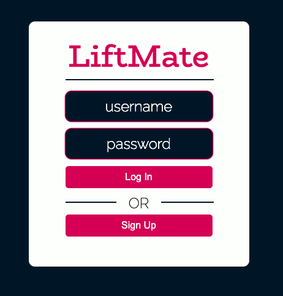
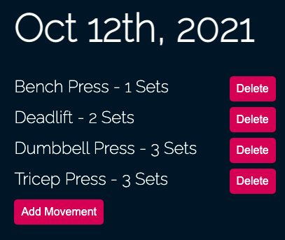
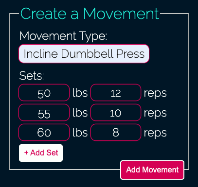

<b>Created by Blake Eriks</b>

[LiftMate](https://lift-mate.herokuapp.com/) is a web app that let's you easily sign up and track your lifts.

## Screenshots

### Login

### Calendar

### Lift View

### Create Lift

## Technologies

* HTML, CSS, Javascript, jQuery
* Node, Express, EJS, HTMX, Alpine
* MongoDB, MongoCloud, Mongoose
* Deployed using Heroku

## Usage

Navigate to https://lift-mate.herokuapp.com/ and create an account to get started. Select any day on the calendar and use the editor on the left to manipulate your workout.

## Planned Development

* CSS animations when loading new content
* Graphics on calendar for days with lifts
* Tags for lifts corresponding to the corresponding movments
* Edit form styling improvements
* Error handling / redirecting on bad logins
* Mobile + Tablet friendly design

